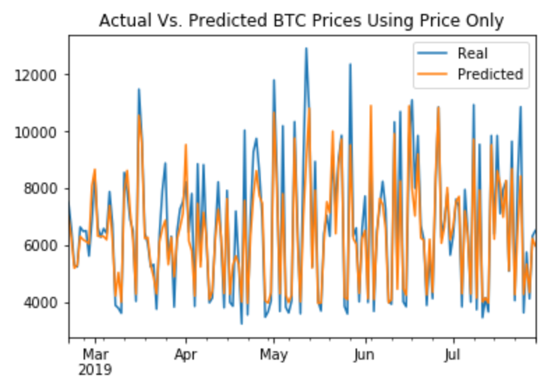
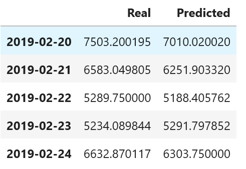
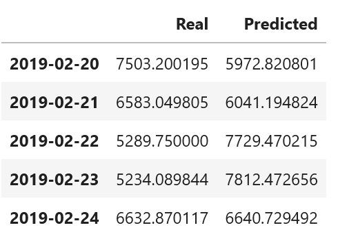
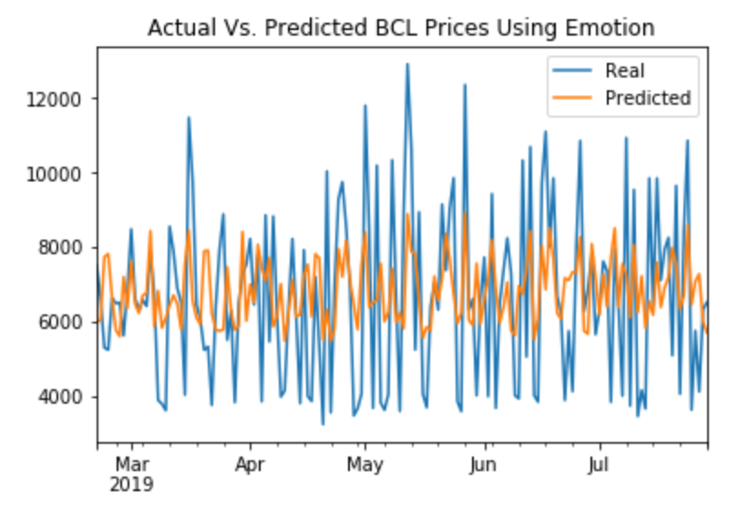

# hw_14_Deep_Learning

This is the submission for homework 14 "Deep Learning". The homework examines the efficacy of predicting bitcoin prices by two methods:

1. [BTC LSTM Prediction Using Price](#1---BTC-LSTM-Prediction-Using-Price)
2. [BTC LSTM Prediction Using Sentiment](#2---BTC-LSTM-Prediction-Using-Sentiment)

The simple one using price came out ahead with a score of 0.00874 vs 0.0473 for the Sentiment (aka Fear and Greed)

A subsequent interesting exercise would be to try an LSTM with two inputs - price and emotion

The assumption I made in this project is that "For training, use at least 10 estimators for both models." means a look back of 10 periods. 

Another interpretation may be varying the estimators 10 times. That seemed outside the scope of the homework. 

### 1 - BTC LSTM Prediction Using Price
[Closing Prices Notebook](./lstm_stock_predictor_closing.ipynb)

In this exercise we examined the predictive power of LSTM using 10 lagged prices.

The predicted prices were:

A chart of predicted vs actual is below:

### 2 - BTC LSTM Prediction Using Sentiment
[FNG Prices Notebook](.//lstm_stock_predictor_fng.ipynb)

We replicated the prediction using FNG index using 10 lagged emotions

The predicted prices were:

A chart of predicted vs actual is below:

